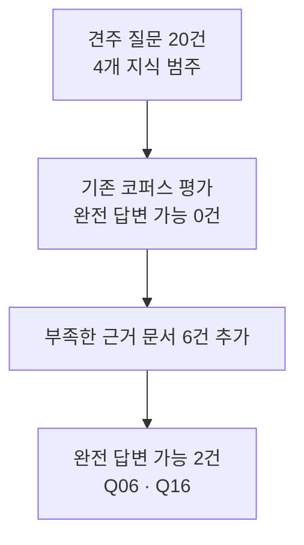
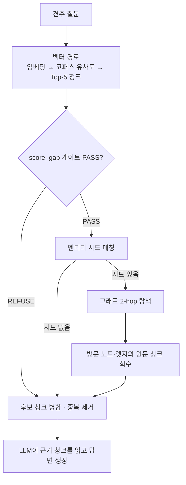
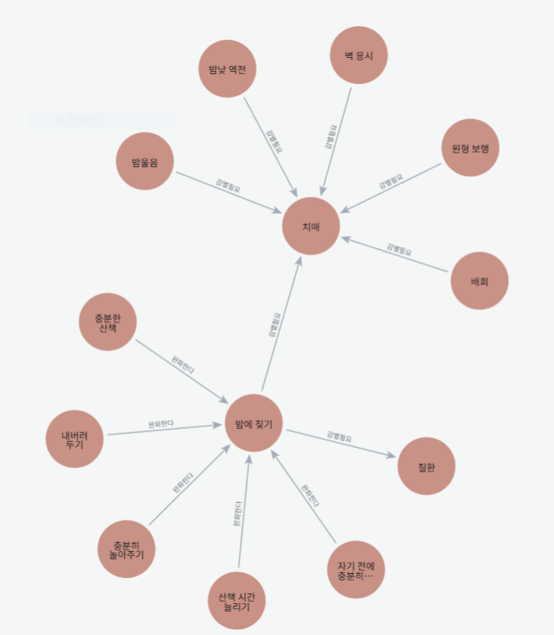

# 8/22 멘토링용 5분 버전 — 강아지 훈련 RAG: 벡터+그래프 하이브리드 검색

`docs/presentation_0825.md`(13장, 중간발표 초안)를 7장으로 압축한 5분 발표 대본입니다. 원본은 그대로 두고 이 파일만 새로 만들었습니다. **발표 노트**는 실제로 읽을 대본이라 전체 약 1,500~1,800자로 맞췄습니다. 근거 데이터·코드 위치는 발표 노트와 분리된 참고 자료로 남겨뒀고, 멘토 질문은 4·5·6장에서는 빼고 7장에 한 문장씩만 모았습니다 — 대본으로 길게 읽지 않고 화면에 띄운 채 구두로 풀어서 여쭙는 용도입니다.

---

## 1. 문제와 측정 — 견주 질문 20건에서 조달까지

**핵심 메시지**: 견주 질문 20건은 4개 지식 범주(단일 절차·비의료 추론·의료 감별·거절 경계)에서 골고루 구성했다. 범주별로 측정해도 완전 답변 가능은 0건이었고, 6건을 조달한 뒤에도 전환된 것은 2건뿐이었다.

**근거 데이터**

| 범주 | 질문 | 설계 신호(`owner_fixtures.jsonl`) | 예시 |
|---|---|---|---|
| ① 단일 절차·훈련법 | Q01–Q05 (5건) | hop=single · router=VECTOR · guard=NONE | Q01 켄넬 적응 단계별 순서 |
| ② 문제행동 원인 추론(비의료 2홉) | Q06–Q10 (5건) | hop=multi · router=GRAPH · guard=NONE | Q07 짖음 원인 분류 → 훈련법 분기 |
| ③ 증상-질환 감별(의료 경계) | Q11–Q16 (6건) | hop=multi · router=GRAPH · guard=STRONG | Q13 야간 헛짖음+노령 → 인지기능장애 감별 |
| ④ 거절 경계 케이스 | Q17–Q20 (4건) | 처방 요청·종 범위 밖·의도적 gap → REFUSE | Q17 처방·사료 요청 거절 |

범주 경계(Q05→Q06, Q10→Q11, Q16→Q17)에서 `hop_type`·`router_target`·`guard_level`이 동시에 바뀐다 — 설계 시점부터 의도된 구성이지 사후 분류가 아니다.

- `reports/owner_fixtures_coverage.md`: coverage 판정 20/20건 — partial 4(Q05·Q09·Q14·Q15), missing 16, **answerable 0**
- gate가 expected_outcome과 갈린 7건(Q01·Q02·Q04·Q11·Q12·Q17·Q19) — **전부 한 방향**(통과시키면 안 될 것을 통과)
- 조달 6건 = 크롤 자동 3건(1a-1 슬개골탈구 네이버블로그, 2-1 AMC 치매 글, 3-1 베럴독 분리불안 글) + **수동 폴백 3건**(1a-2 YD 슬개골, 1b-1 YD 외이염, 3-3 살구뉴스 켄넬 STEP)
- 슬롯 1b(외이염): 크롤 풀 **718건 중 관련 언급 10건**이지만 전부 입질교정 글에 스친 한 줄뿐, 귓병 통증의 행동 변화를 다룬 글은 **0건** → 처음부터 수동 수집으로만 채움 (`docs/acquisition_list.md` 문서1b)
- 결과: **Q06·Q16만 해제** (겨냥 슬롯 문서 top-5 5/5), 나머지 4건(Q12·Q13·Q14·Q15) 미해제/부분 — Q13의 겨냥 문서(슬롯2, AMC 치매 글)는 조달됐지만 벡터로는 안 닿았고, 그래프가 나중에 이 문서를 찾아낸다(3장)

**발표 노트**

질문 20개는 임의로 모은 목록이 아니라, 네 개 지식 범주에서 골고루 구성했습니다. 각 범주에서 기존 코퍼스가 어디까지 답할 수 있는지 먼저 측정했고, 완전 답변 가능은 0건이었습니다. 이후 부족한 근거를 겨냥해 6개 문서를 추가했지만, 완전 답변 가능으로 전환된 질문은 2건뿐이었습니다. 이 중 그래프 후보 확장이 실제 답변 근거에 반영된 사례가 뒤에서 볼 Q13입니다.

---

## 2. 질문 하나를 두 경로로 검색하고, 근거 청크를 합쳐 답한다

**핵심 메시지**: 벡터 검색과 그래프 탐색은 각각 근거가 될 수 있는 청크 후보를 찾아올 뿐이다. 그 후보를 읽고 답을 정하는 것은 LLM이다.

**근거 데이터**

- 그래프 탐색 결과의 엔티티·관계에 연결된 원문 chunk ID를 회수해 벡터 top-5와 병합한 뒤 답변 모델에 전달한다 — `graph_search()`가 방문한 노드·엣지의 `source_chunks`를 모아 청크로 바꾸고(`scripts/run_combined_retrieval_eval.py:302-331`), `hybrid_merge()`가 벡터 top-5 뒤에 이어붙여 중복만 제거하며(같은 파일:334-344), `generate_answers.py`가 그 결과를 `build_prompt()`에 그대로 넣는다(`scripts/generate_answers.py:837-854`)
- 그래프 경로는 `score_gap` 게이트가 PASS일 때만 실행된다 — REFUSE거나 의료 질문으로 판정되면 그래프를 아예 부르지 않고 벡터 top-5만 근거로 쓴다 (`docs/graph_hybrid_retrieval_design.md` 결정3)
- 그래프가 돌려주는 것은 순서 없는 청크 목록뿐이다. 점수도, "이게 정답이다"라는 판단도 없다

> 그래프는 답을 생성하지 않는다. 벡터 검색에서 빠진 근거 청크 후보를 확장하는 역할이다.

**발표 노트**

검색은 벡터 경로로 시작합니다. 질문을 임베딩해 코퍼스 전체와 유사도를 재고 top-5를 뽑은 뒤, 그 score_gap이 게이트를 통과할 때만 그래프 경로를 추가합니다 — 신뢰도 낮은 질문까지 그래프로 근거를 부풀리지 않기 위해서입니다. 그래프는 엔티티 시드에서 2홉을 걸어 지나간 노드·엣지의 원문 청크를 회수해 후보로 돌려줄 뿐이고, 이 후보를 벡터 top-5 뒤에 합쳐 중복만 제거한 것이 최종 근거입니다. 답을 쓰는 건 전부 LLM입니다.

---

## 3. Q13 — 벡터가 놓친 근거를 그래프가 후보에 더하다

**핵심 메시지**: 벡터 검색은 질문과 표면적으로 가까운 "분리불안 훈련" 청크에 집중했고, 그래프 탐색은 노령견·밤에 짖기·치매의 관계를 따라 감별 문서를 후보로 추가했다 — 추가된 감별 근거가 최종 LLM 답변에 반영된 사례가 Q13이다.

**근거 데이터**

- 통합 83청크 → 노드 284개(증상86·훈련법62·문제행동51·용품21·질환21·견종19·원칙18·연령대6), 엣지 102개(감별필요60·완화한다28·선행조건9·악화시킨다4·금기1) — `docs/handoff_neo4j.md`
- Q13: "12살 노령견인데 밤마다 서성거리며 벽을 보고 헛짖음을 시작했어요. 분리불안 훈련이 효과가 있을까요?"
- 매칭 시드 7개(노령견·분리불안·불안·짖음 등) → 그래프 후보 13건, 핵심은 "밤에 짖는 강아지" 문서 — `reports/demo_outputs_0820.md` 2절

| 비교 항목 | 벡터만 | 하이브리드 |
|---|---|---|
| Top-5 / 후보 청크 구성 | 5건 모두 "강아지 분리불안 훈련" 문서 | 벡터 5건 + 그래프 후보 13건(영상 3·문서 10, "밤에 짖는 강아지" 포함) |
| 답변 요지 | "분리불안 훈련 방법을 제시합니다" | "치매 증상과 일부 겹침 … 훈련 효과 판단 불가 … 수의사 상담 권장" |
| 놓친 근거 / 추가된 근거 | 치매·관절통증 감별 근거가 top-5 밖이라 못 봄 | [7] "밤에 짖는 강아지" 청크가 후보에 들어와 실제로 인용됨 |

밤에 짖기 → 치매는 다른 치매 증상(밤낮 역전·벽 응시·원형 보행·배회·밤 울음)과 같은 **감별필요** 엣지로 연결돼 있고, 산책·놀아주기 등 완화 행동은 **완화한다** 엣지로 밤에 짖기에 따로 붙어 있습니다. 브라우저 UI·쿼리 창은 잘라내고 이 경로만 남겼습니다.

**발표 노트**

Q13에서 벡터 top-5는 전부 같은 "분리불안 훈련" 문서였습니다 — 질문 표면의 "분리불안"과 가장 가까운 청크만 골랐기 때문입니다. 그래프는 노령견·짖음·분리불안에서 2홉을 걸어 후보 13건을 추가했고, 그중 벡터가 놓친 문서 "밤에 짖는 강아지"([7])가 실제로 인용됐습니다. 그래프는 이 문서가 정답이라고 판단하지 않습니다 — 후보 13건 중 무엇을 쓸지는 LLM이 정했고, 그 결과 치매 증상과 겹친다는 점과 수의사 상담을 답변에 반영했습니다.

---

## 4. 한계① — 실패는 코퍼스·시드·게이트·랭킹, 네 단계에서 각각 다르게 일어난다

**핵심 메시지**: 리터럴 매칭·게이트 임계값·벡터 랭킹이 같은 시기에 함께 흔들렸지만 원인은 하나가 아니다 — 코퍼스 공백, 시드 매칭 실패, 게이트 판별력 상실, 랭킹 근소 이탈은 서로 다른 단계에서 일어난 별개의 문제다.

**근거 데이터**

| 단계 | 실패 양상 | 사례 |
|---|---|---|
| 코퍼스 | 근거 문서 자체가 코퍼스에 없음 | Q12 — 그래프 후보 2건을 찾았지만 "서열 훈련" 개념 자체가 코퍼스에 없음 |
| 시드 매칭 | `match_seeds()`가 리터럴 포함만 봐서 표현이 다르면 그래프가 안 돎 | Q14 — 매칭 시드 0개, 그래프 후보 0건 (`reports/retrieval_gap_hybrid_vs_vector_0820.md`) |
| 게이트 | 코퍼스 평균이 낮아지며 `score_gap ≥ 0.024`가 대부분 통과됨 | owner 20건 중 19건 PASS·1건(Q10) REFUSE(기대와 일치), top1이 실제로 오른 건 8건뿐, 12건은 산술 효과 (`reports/combined_corpus_coverage.md` ⓪절) |
| 벡터 랭킹 | 신규 청크가 근소한 점수 차로 새치기 | q003: 0.000553(≈0.0006) 차이로 top-5 이탈(`reports/q003_top5_investigation_0820.md`); Q15: 겨냥 문서 5위 근소 + 그래프 시드도 0개(이중 실패) |

**발표 노트**

실패를 네 단계로 나눠 봤습니다. Q12는 그래프가 후보를 찾았어도 "서열 훈련" 개념 자체가 코퍼스에 없어 코퍼스 단계에서 막힙니다. Q14는 시드 매칭 자체가 안 돼 그래프가 아예 안 돕니다. 게이트는 코퍼스 평균이 낮아지며 19문항이 PASS로 몰렸고(REFUSE로 남은 Q10은 기대 판정과 일치), top1이 실제로 오른 건 8건뿐입니다. 벡터 랭킹에서는 q003과 Q15가 근소한 점수 차로 top-5·시드 양쪽에서 밀렸습니다. 네 단계는 원인이 각각 달라서, 하나의 해법으로 한꺼번에 풀리지 않습니다 — "그래프가 실패했다"는 한 문장으로 뭉치면 이 네 이야기가 안 보입니다.

---

## 5. 한계② 스키마가 훈련을 못 담음 — 세 겹 원인

**핵심 메시지**: 훈련 지식 그래프를 목표했는데 나온 것은 질환 감별 그래프에 가깝다 — 원인은 코퍼스 선정, 관계 타입 설계, 부정문 추출 실패가 겹쳐 있다.

**근거 데이터**

1. **코퍼스 선정**: 조달 6건 중 4건(1a-1·1a-2·1b-1·2-1)이 감별 축, 절차 축은 2건(3-1·3-3)뿐. 최종 엣지 102개 중 **감별필요가 60개(59%)**로 완화한다(28)의 두 배 이상 — 조달이 감별 위주였던 그대로 그래프도 감별 위주가 됨
2. **절차·순서 관계 타입 부재**: 엣지 타입은 완화한다·악화시킨다·선행조건·금기·감별필요 5개뿐, "다음 단계" 개념이 없음. 살구뉴스 켄넬 STEP 문서(10청크) 실측: 켄넬훈련·크레이트적응훈련·이동장훈련 등 STEP별 훈련법 엔티티는 각 청크에서 뽑혔지만(`data/graph/extractions_stage2.jsonl`), **청크 간 연결 엣지는 0건** — STEP1→…→STEP6 순서가 그래프에 전혀 안 남음. 관계의 source/target을 같은 청크 내로 제한하는 규칙(`scripts/extract_entities.py` RULES 2)도 구조적으로 이를 막음
3. **부정 명령문 미추출**: `docchunk-7f889386`의 "이동장을 잠그거나 홀로 두면 안 된다"는 문장이 어떤 entity의 evidence에도 없고 `relations`가 빈 배열 — 그래프 전체 금기 엣지가 1개뿐인 것과 같은 원인 (`docs/agenda_0825.md` 안건5)

**발표 노트**

훈련 지식 그래프를 목표했는데 실제로 나온 건 질환 감별 그래프에 가깝습니다. 원인은 셋입니다 — 조달 6건 중 넷이 감별 축이라 관계의 59%가 감별필요이고, 엣지 타입에 "다음 단계"가 없어 켄넬 STEP1~6이 서로 연결되지 않으며, 부정 명령문은 금기 행위가 엔티티로 안 뽑혀 관계도 안 생깁니다. 금기 엣지가 그래프 전체에 1개뿐인 이유이고, 처치 순서·금지 사항을 다루는 훈련 자료일수록 이 그래프에 덜 담깁니다.

---

## 6. 재현성과 질문 — 전량 재추출 비결정성, 동결로 대응

**핵심 메시지**: 그래프 추출은 청크 증분이 아니라 코퍼스 전체를 매번 다시 돌리는 구조이고 재실행마다 결과가 흔들려서, 오늘 그래프는 재현 가능한 스냅샷을 얼려서만 쓴다.

**근거 데이터** (`docs/handoff_neo4j.md`)

- Stage 2는 **코퍼스 전체를 매번 재추출** — 청크 단위 증분 아님
- 같은 입력에도 `reasoning_effort: low`, 온도 미전송 조건에서 결과가 흔들림 — 실측: 분리불안 경로 수가 재적재 사이 **27 → 22**로 변동, 슬개골 경로(19)는 동일 유지
- 대응: `frozen/frozen_stage2_0820.jsonl` + `frozen_entity_aliases_0820.json`을 저장소에 동결해 커밋, `--wipe`로만 재현 (재추출 금지)

**발표 노트**

그래프 추출은 청크 증분이 아니라 코퍼스 전체를 매번 재추출합니다. 같은 입력에도 LLM 추출이라 결과가 흔들립니다 — 분리불안 경로가 재적재 사이 27→22로 변동했고, 슬개골 경로(19)는 그대로였습니다. 오늘 보여드리는 284노드·102엣지는 특정 시점을 통째로 얼린 파일에서 복원했고, 재추출이 아니라 동결 파일로만 재현하기로 정했습니다. 이 숫자들이 이 동결 시점 기준이라는 것도 함께 밝혀 둡니다.

---

## 7. 멘토님께 드리는 질문 세 가지

**핵심 메시지**: 오늘 나온 멘토 질문 세 개를 한 문장씩 정리한다 — 대본으로 길게 읽지 않고 화면에 띄워 구두로 풀어서 여쭙는다.

**질문①** (5장, 스키마): 코퍼스 선정·절차 관계 부재·부정문 미추출이 겹친 원인인데, 관계 타입만 추가하면 풀립니까, 아니면 스키마 자체가 절차·금지 지식에는 안 맞는 형식입니까?

**질문②** (4장, 실패 단계): 코퍼스·시드매칭·게이트·랭킹 네 단계 실패를 리랭커·쿼리 확장·신호 교체 중 무엇으로, 어떤 순서로 풀어야 합니까?

**질문③** (6장, 재현성): LLM 추출의 비결정성을 실무에서는 증분 추출·다중 합의·버전 관리 중 어떤 방식으로 다룹니까?

**발표 노트**

세 질문은 화면에 띄워두고 구두로 풀어서 여쭙겠습니다 — 대본으로 길게 읽지 않습니다.
